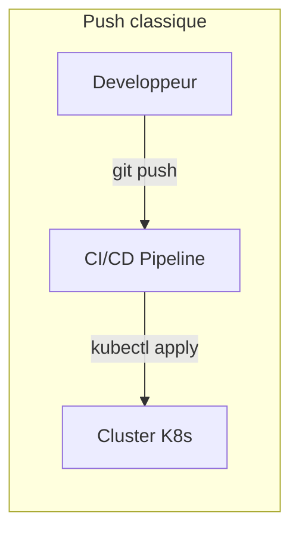
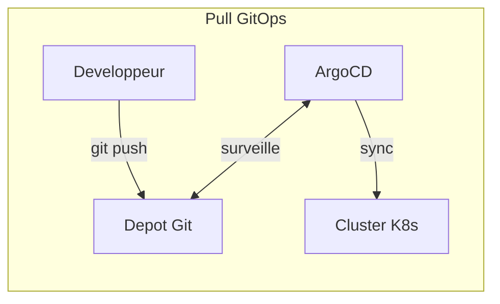
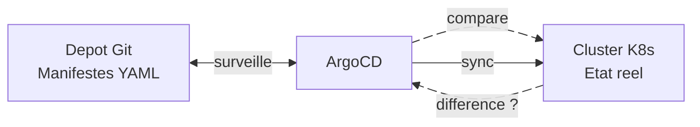
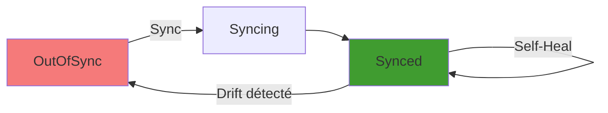
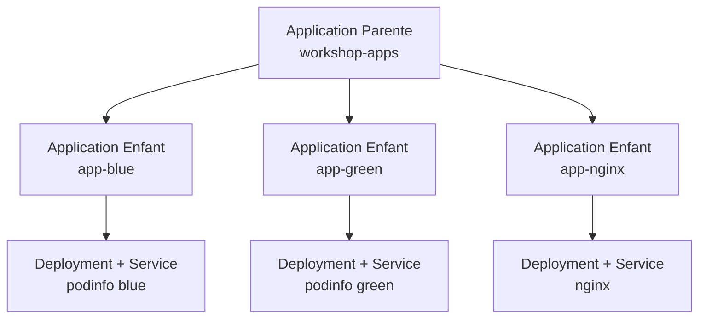
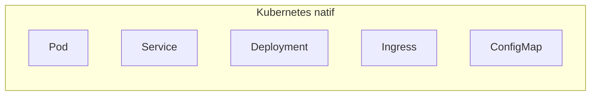
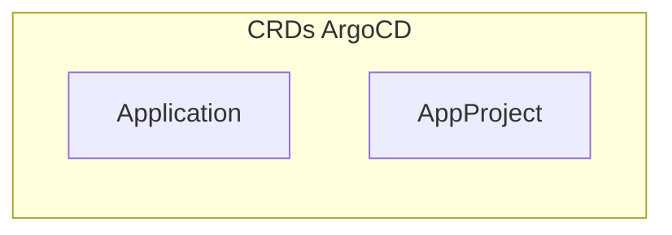
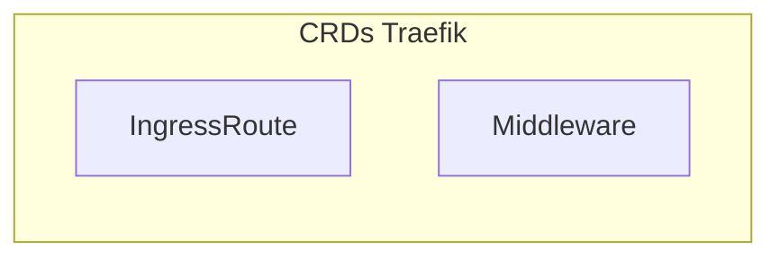
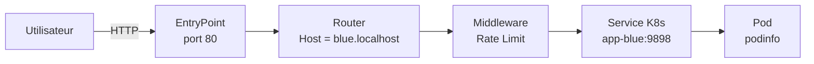
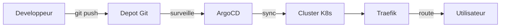

# GitOps & Routing

<div class="absolute bottom-10">
  <span class="font-700">
    2026 &mdash; DevOps Workshop 2/3
  </span>
  <p class="text-sm opacity-75">CRDs, ArgoCD, App of Apps et routage avec Traefik</p>
</div>

<!-- Bienvenue dans ce second workshop. Prerequis : avoir suivi le Workshop 1 sur Kubernetes et Helm. Aujourd'hui on couvre le GitOps avec ArgoCD et le routage avec Traefik. -->
---
layout: section
---

# Plan du workshop

- **Partie 1** : Qu'est-ce que le GitOps ?
- **Partie 2** : ArgoCD en pratique
- **Partie 3** : App of Apps
- **Partie 4** : Étendre Kubernetes avec les CRDs
- **Partie 5** : Traefik

---
layout: statement
---

<span class="absolute top-52 inset-x-0 text-2xl text-gray-500">Partie 1</span>

# Qu'est-ce que le GitOps ?

<!-- Dans ce premier module, nous allons comprendre ce qu'est le GitOps, pourquoi c'est une evolution par rapport au deploiement classique, et comment ArgoCD s'inscrit dans cette approche. -->

---

# Le problème

<v-clicks>

- Dans le Workshop 1, on deployait avec `kubectl apply`
- Qui a deployé quoi ? Quand ? Pourquoi ?
- **Config drift** : le cluster diverge de ce qu'on voulait
- Pas d'historique, pas de review, pas de rollback facile

</v-clicks>

<!-- On a vu dans le premier workshop que kubectl apply fonctionne bien en local. Mais en equipe, on perd vite la trace de qui a fait quoi. Le cluster peut diverger silencieusement de ce qu'on voulait. -->

---

# L'evolution du deploiement

<v-clicks>

- **SSH + scripts manuels** — fragile, non reproductible
- **CI/CD push** (`kubectl apply` dans le pipeline) — mieux mais le pipeline a les credentials
- **GitOps pull** (un agent dans le cluster tire depuis Git) — le cluster se met a jour tout seul

</v-clicks>

<!-- On est passe des scripts manuels au CI/CD, puis au GitOps. Chaque etape a ameliore la fiabilite et la securite. Le GitOps est l'etape suivante car il inverse le flux : c'est le cluster qui tire depuis Git, pas le pipeline qui pousse vers le cluster. -->

---

# Le principe GitOps

<v-clicks>

- **Git = source unique de verité** (single source of truth)
- Tout changement passe par un **commit Git**
- Un agent dans le cluster **surveille** le depot Git
- **Reconciliation automatique** : le cluster converge vers l'état Git

</v-clicks>
<v-clicks>

> "If it's not in Git, it didn't happen"

</v-clicks>


<!-- Le GitOps repose sur quatre principes fondamentaux : Git est la source de verite, tout passe par un commit, un agent surveille le depot, et la reconciliation est automatique. La citation resume bien la philosophie. -->

---

# Push vs Pull

<div class="flex gap-10">

<div>



</div>
<div>




<v-clicks>

- **Push** : le pipeline a besoin d'acces au cluster (credentials)
- **Pull** : seul l'agent dans le cluster a acces, Git est la seule interface

</v-clicks>

</div>

</div>

<!-- La difference fondamentale est la direction du flux. En push, le pipeline doit avoir des credentials pour acceder au cluster. En pull, seul l'agent dans le cluster a acces. C'est plus sécurisé et plus simple à gérer. -->

---

# Le vocabulaire GitOps

<v-clicks>

- **Desired State** : l'état déclaré dans Git (les manifestes YAML)
- **Live State** : l'état réel dans le cluster
- **Drift** : divergence entre Desired State et Live State
- **Sync** : action de réconcilier Live State vers Desired State
- **Self-Heal** : correction automatique quand quelqu'un modifie le cluster manuellement

</v-clicks>

<!-- Ces termes reviennent en permanence dans le monde GitOps. Retenez-les bien, on les utilisera tout au long du workshop. Le drift est l'ennemi, le sync est le remède, le self-heal est la prévention. -->

---

# La boucle de reconciliation GitOps



<v-clicks>

- ArgoCD tourne **en boucle** (toutes les 3 minutes par défaut)
- Il compare l'état Git avec l'état du cluster
- S'il y a une différence, il **synchronise**

</v-clicks>

<!-- Cette boucle est le coeur du GitOps. ArgoCD vérifie en permanence que le cluster correspond à ce qui est dans Git. Si quelqu'un fait un kubectl edit en direct, ArgoCD le détecte et peut corriger automatiquement. -->

---

# ArgoCD

<v-clicks>

- **Open-source**, projet CNCF (Cloud Native Computing Foundation)
- **Kubernetes-native** : s'installe dans le cluster, utilise des CRDs
- **Interface web** + CLI pour visualiser et gerer les deploiements
- **Multi-repo, multi-cluster** : peut gerer plusieurs depots et clusters
- Supporte : raw YAML, Helm, Kustomize, ...

</v-clicks>

<!-- ArgoCD est l'outil GitOps le plus populaire. Il est maintenu par la CNCF, comme Kubernetes. Il s'installe dans le cluster et utilise des Custom Resource Definitions pour sa configuration. -->

---

# Notre setup aujourd'hui

<v-clicks>

- **minikube** = cluster Kubernetes local
- **ArgoCD** = agent GitOps (installé via Helm)
- **Traefik** = reverse proxy / ingress controller
- Architecture : Git → ArgoCD → K8s → Traefik → Utilisateur

</v-clicks>

<!-- On reutilise minikube du Workshop 1. On va installer ArgoCD via Helm, puis Traefik pour le routage. A la fin du workshop, le flux complet ira du commit Git jusqu'a l'utilisateur final. -->

---

# Résumé Partie 1

<v-clicks>

- GitOps = **Git est la source de verite**
- **Pull > Push** : l'agent tire depuis Git
- ArgoCD = l'agent GitOps qui reconcilie

</v-clicks>

<!-- Vous avez maintenant les bases theoriques du GitOps. On va passer a la pratique avec ArgoCD. -->

---
layout: statement
---

<span class="absolute top-52 inset-x-0 text-2xl text-gray-500">Partie 2</span>

# ArgoCD en pratique

<!-- Dans ce module, on va voir comment ArgoCD fonctionne concretement. On va decouvrir l'Application CRD, les mecanismes de sync et de self-heal. -->

---

# L'Application CRD 

```yaml {1-2|3-5|6-15|all}
apiVersion: argoproj.io/v1alpha1
kind: Application
metadata:
  name: mon-app
  namespace: argocd
spec:
  source:
    repoURL: https://github.com/...
    path: manifests/
  destination:
    server: https://kubernetes.default.svc
    namespace: workshop
  syncPolicy:
    automated:
      selfHeal: true
```

<v-clicks>

- **source** : d'ou viennent les manifestes (Git repo + path)
- **destination** : ou les deployer (cluster + namespace)
- **syncPolicy** : sync manuelle ou automatique

</v-clicks>

<!-- L'Application est le CRD central d'ArgoCD. Il fait le lien entre un depot Git et un namespace Kubernetes. La source pointe vers un repo Git et un chemin, la destination vers un cluster et un namespace. -->

---

# Le cycle de vie d'une Application



<v-clicks>

- **OutOfSync** : Git et cluster ne correspondent pas
- **Synced** : tout est aligné
- **Healthy / Degraded / Progressing** : état de santé des ressources

</v-clicks>

<!-- Une Application passe par differents etats. OutOfSync signifie que Git et le cluster ne correspondent pas. Synced signifie que tout est aligné. En parallele, ArgoCD surveille aussi la sante des ressources deployees. -->

---

# Sync, Drift et Self-Heal

<v-clicks>

- **Sync** = appliquer l'état Git dans le cluster
- **Drift** = quelqu'un modifie le cluster directement (`kubectl scale`, `kubectl edit`...)
- **Self-Heal** = ArgoCD détecte le drift et revert automatiquement
- Sans self-heal, ArgoCD signale le drift mais ne corrige pas

</v-clicks>

<!-- Le sync est l'action de base. Le drift arrive quand quelqu'un modifie le cluster en dehors de Git. Le self-heal est la reponse automatique au drift. Sans self-heal active, ArgoCD se contente de signaler le probleme dans l'interface. -->

---

# Auto-Sync et Prune

<v-clicks>

- **Auto-Sync** : ArgoCD synchronise automatiquement quand Git change (pas besoin de cliquer "Sync")
- **Prune** : ArgoCD supprime les ressources du cluster qui ont été supprimées de Git
- Sans prune, les ressources orphelines restent dans le cluster
- Combinaison ideale : `autoSync` + `selfHeal` + `prune`

</v-clicks>

<!-- L'auto-sync evite de devoir cliquer manuellement sur Sync a chaque commit. Le prune est important pour nettoyer les ressources qui n'existent plus dans Git. La combinaison des trois donne un workflow GitOps complet. -->

---

# Rollback

<v-clicks>

- ArgoCD conserve l'**historique** de chaque sync
- Rollback = re-synchroniser vers une revision Git précédente
- En GitOps pur, le vrai rollback c'est un **git revert** (la vérité est dans Git)
- L'historique ArgoCD est un raccourci pratique

</v-clicks>

<!-- ArgoCD garde un historique de chaque synchronisation. On peut faire un rollback depuis l'interface. Mais en GitOps pur, le vrai rollback passe par un git revert pour que la vérité reste dans Git. -->


---
layout: fact
---

<span class="absolute top-30 inset-x-0 text-2xl text-gray-500">Exercice 1</span>

# ArgoCD basics

Rendez-vous dans `exercises/01-argocd-basics/`

**Duree : ~30 minutes**

Objectif : deployer via ArgoCD, observer le drift et le self-heal

<!-- Laissez les participants faire l'exercice. Passez dans les rangs pour aider ceux qui sont bloques. -->
---

# Bonus : Alternative à ArgoCD

<v-clicks>

- **FluxCD** : autre outil GitOps populaire, aussi CNCF
  - FluxCD utilise des controllers Kubernetes pour la reconciliation
  - ArgoCD a une interface web intégrée, FluxCD se combine souvent avec Grafana
  - Les concepts sont similaires : Application CRD, sync, drift, etc.
- **Jenkins X** : plateforme CI/CD avec GitOps intégré
  - Jenkins X utilise FluxCD pour le GitOps
  - Offre des pipelines CI/CD préconfigurés et une gestion multi-environnement
- **Rancher Fleet** : GitOps pour la gestion multi-cluster
  - Fleet est concu pour gerer des centaines de clusters depuis un depot Git central
  - Il utilise une architecture similaire au pattern App of Apps

</v-clicks>

---
layout: statement
---

<span class="absolute top-52 inset-x-0 text-2xl text-gray-500">Partie 3</span>

# App of Apps

<!-- Ce module presente le pattern App of Apps, qui permet de gerer plusieurs Applications ArgoCD de maniere declarative via Git. -->

---

# Le probleme : beaucoup d'Applications

<v-clicks>

- 1 Application = `kubectl apply -f application.yaml`
- 5 Applications = 5 fichiers a appliquer manuellement...
- 50 Applications = pas tres GitOps
- On veut gerer les Applications **elles-mêmes** via Git

</v-clicks>

<!-- Quand on a une seule Application, c'est simple. Mais en production, on a souvent des dizaines d'applications. Appliquer chaque fichier manuellement va a l'encontre du principe GitOps. -->

---

# Le pattern App of Apps



<v-clicks>

- L'application **parente** surveille un dossier contenant des YAML d'Applications
- Chaque application **enfant** surveille un dossier de manifestes K8s
- ArgoCD fait le lien automatiquement

</v-clicks>

<!-- Le pattern App of Apps cree une hierarchie. La parente ne deploie pas de workloads, elle deploie des Applications enfants. Chaque enfant deploie ensuite ses propres ressources K8s. -->

---

# En pratique

```yaml
apiVersion: argoproj.io/v1alpha1
kind: Application
metadata:
  name: workshop-apps
spec:
  source:
    repoURL: https://github.com/...
    path: argocd-apps/    # Contient d'autres fichiers YAML d'Applications
  destination:
    namespace: argocd     # Les enfants vivent dans le namespace argocd
```

<v-clicks>

- Le dossier `argocd-apps/` contient un fichier par application
- Ajouter une app = ajouter un fichier YAML + commit

</v-clicks>

<!-- La parente pointe vers un dossier qui contient des fichiers YAML d'Applications. ArgoCD crée automatiquement les Applications enfants correspondantes. Le namespace de destination est argocd car les Applications sont des ressources du namespace argocd. -->

---

# Ajouter une application = un commit

<v-clicks>

- Nouveau fichier `argocd-apps/app-red.yaml` — git add, git commit, git push
- ArgoCD détecte le changement dans le dossier
- Nouvelle Application enfant créée automatiquement
- Nouveau workload déployé dans le cluster
- **Zero kubectl, 100% Git**

</v-clicks>

<!-- C'est la puissance du pattern App of Apps. Pour ajouter une application, il suffit d'ajouter un fichier YAML dans le dossier et de committer. Aucune commande kubectl necessaire. -->

---
layout: fact
---

<span class="absolute top-30 inset-x-0 text-2xl text-gray-500">Exercice 2</span>

# App of Apps

Rendez-vous dans `exercises/02-app-of-apps/`

**Duree : ~25 minutes**

Objectif : deployer 3 applications d'un coup avec le pattern App of Apps

<!-- Les participants vont mettre en place le pattern App of Apps. Ils deploieront une application parente qui gere trois applications enfants. -->

---
layout: fact
---

<span class="absolute top-40 inset-x-0 text-2xl text-gray-500">Partie 4</span>

# Étendre k8s avec les CRDs

<!-- Ce module explique ce que sont les Custom Resource Definitions et comment elles permettent d'étendre l'API Kubernetes. -->

---

# Qu'est-ce qu'un CRD ?

<v-clicks>

- **Custom Resource Definition** : étendre l'API Kubernetes
- Kubernetes est livré avec des ressources natives : Pod, Service, Deployment...
- N'importe qui peut ajouter ses **propres types de ressources**
- Un CRD = la définition, un CR = une instance de cette définition

</v-clicks>

<!-- Les CRDs sont un mecanisme fondamental de Kubernetes. Ils permettent a n'importe quel operateur d'etendre l'API avec ses propres types de ressources. C'est ce qui rend Kubernetes si extensible. -->

---

# On a deja utilise des CRDs !

<v-clicks>

- `Application` (ArgoCD) — `kubectl get applications -n argocd`
- `AppProject` (ArgoCD) — `kubectl get appprojects -n argocd`
- Ces ressources n'existent pas dans un Kubernetes standard
- ArgoCD les a ajoutées via ses CRDs lors de l'installation
- `kubectl get crds | grep argo` — les CRDs d'ArgoCD

</v-clicks>

<!-- Vous avez deja utilise des CRDs sans le savoir. L'Application ArgoCD est un Custom Resource. Elle n'existe pas dans un Kubernetes vanilla. C'est ArgoCD qui a installe les CRDs correspondants. -->

---

# Ressources natives vs Custom Resources



<div class="flex gap-10">

<v-clicks>





</v-clicks>

</div>

<v-clicks>

- Les CRDs permettent a l'ecosysteme K8s de **grandir**
- Cert-manager, Prometheus, Istio... tous ajoutent leurs CRDs
- La commande `kubectl` fonctionne avec **toutes** les ressources (natives et custom)

</v-clicks>

<!-- Ce diagramme montre la distinction entre ressources natives et custom. Kubernetes natif fournit Pod, Service, etc. ArgoCD et Traefik ajoutent leurs propres types. kubectl fonctionne de la meme maniere avec toutes ces ressources. -->


---
layout: fact
---

<span class="absolute top-40 inset-x-0 text-2xl text-gray-500">Partie 5</span>

# Traefik en pratique

<!-- Introduction de Traefik comme ingress controller avec ses propres CRDs. -->

---

# Traefik : reverse proxy cloud-native

<v-clicks>

- **Ingress Controller** : route le trafic externe vers les Services du cluster
- Découverte automatique via l'API Kubernetes
- Configuration via **CRDs** (pas de fichiers de config statiques à maintenir)
- **Certificats TLS automatiques** via Let's Encrypt (ACME intégré)
- Supporte HTTP, TCP, UDP et WebSocket nativement
- Dashboard intégré pour la visualisation du routage en temps réel

</v-clicks>

<!-- Traefik est un reverse proxy moderne conçu pour le cloud. Il découvre automatiquement les services via l'API Kubernetes et se configure via des CRDs. Fini les rechargements de config Nginx à la main. -->


---
layout: two-cols
layoutClass: gap-8
---

# Ingress vs Gateway API


::left::

<v-clicks>

### 📦 Ingress <span class="text-sm opacity-60">(legacy)</span>

- Ressource monolithique, tout en un
- Annotations vendor-specific → couplage fort
- Aucune séparation des responsabilités
- HTTP/HTTPS uniquement
- Pas de routing avancé natif (TCP, UDP, weights)
```yaml
apiVersion: networking.k8s.io/v1
kind: Ingress
metadata:
  annotations:
    nginx.ingress.kubernetes.io/rewrite-target: /
spec:
  rules:
    - host: app.example.com
```
</v-clicks>

::right::

<v-clicks>

### 🚀 Gateway API <span class="text-sm opacity-60">(standard actuel)</span>

- Découpage clair : `GatewayClass` → `Gateway` → `HTTPRoute`
- Routing avancé natif : weights, headers, TCP, gRPC
- RBAC-friendly — infra et devs ont des périmètres séparés
- CNCF Graduated, intégré à K8s depuis 1.28
```yaml
apiVersion: gateway.networking.k8s.io/v1
kind: HTTPRoute
spec:
  parentRefs:
    - name: main-gateway
  rules:
    - backendRefs:
        - name: my-svc
          port: 80
```
</v-clicks>

---

# Ingress vs IngressRoute vs Gateway API

<v-clicks>

- **Ingress** (natif K8s) : basique, limité — pas de middlewares, pas de TCP/UDP, pas de regex
- **Gateway API** (nouveau standard K8s) : successeur officiel de l'Ingress, séparation des rôles, multi-protocoles
- **IngressRoute** (CRD Traefik) : puissant et flexible — middlewares, weighted routing, TCP/UDP
- Traefik supporte les **trois modes** — on privilégiera **IngressRoute** dans nos exercices

</v-clicks>

<!-- Kubernetes fournit une ressource Ingress native mais elle est limitee. Traefik propose IngressRoute qui est beaucoup plus flexible. C'est la methode recommandee pour configurer le routage avec Traefik. -->

---

# Les solutions de routing K8s

<v-clicks>

- **Traefik** — auto-découverte, TLS automatique, middlewares riches, Gateway API v3, dashboard intégré
- **Nginx Ingress** — le plus répandu, ultra stable, grande communauté, mais config via annotations verbeuses
- **HAProxy** — excellent pour le TCP/UDP avancé et les hautes performances, moins natif K8s
- **Envoy Gateway** — implémentation de référence CNCF pour la Gateway API pure, data plane Envoy
- **Istio** — service mesh complet (mTLS, observabilité, traffic management), mais complexité opérationnelle élevée

</v-clicks>

<!-- Chaque outil a ses forces. Nginx est le plus répandu et battle-tested. Envoy Gateway est la référence CNCF pour la Gateway API pure. Istio uniquement si on a besoin d'un service mesh complet avec mTLS entre tous les services. Traefik couvre tous nos besoins sans surcoût opérationnel. -->


---

# Le flux d'une requete



<v-clicks>

- **EntryPoint** : port d'écoute (80, 443)
- **Router** : règle de routage (quel host ? quel path ?)
- **Middleware** : transformation de la requete (rate limit, auth, headers...)
- **Service** : le backend K8s cible

</v-clicks>

<!-- Chaque requete HTTP traverse cette chaine. L'EntryPoint recoit la connexion, le Router determine ou l'envoyer, les Middlewares transforment la requete, et le Service la transmet au Pod final. -->

---

# Les Middlewares

<v-clicks>

- **RateLimit** : limiter le nombre de requetes par seconde
- **Headers** : ajouter/modifier des headers HTTP
- **BasicAuth** : authentification HTTP basique
- **StripPrefix** : retirer un prefixe du path avant d'envoyer au backend
- **Compress** : compresser les reponses (gzip)
- Les middlewares se **chainent** : une requete traverse plusieurs middlewares avant d'atteindre le backend

</v-clicks>

<!-- Traefik propose de nombreux middlewares. On peut les combiner pour creer des chaines de traitement. Par exemple, rate limit puis compression puis envoi au backend. Chaque middleware est une ressource K8s independante. -->


---

# Installer Traefik via ArgoCD

```yaml
apiVersion: argoproj.io/v1alpha1
kind: Application
spec:
  source:
    repoURL: https://traefik.github.io/charts
    chart: traefik
    targetRevision: "39.0.7"
    helm:
      valuesObject:
        service:
          type: LoadBalancer
```

<v-clicks>

- ArgoCD supporte les **Helm charts** comme source
- Même interface, même workflow GitOps
- `valuesObject` = équivalent d'un fichier `values.yaml` inline

</v-clicks>

<!-- ArgoCD peut deployer des Helm charts directement. On pointe vers le repo Helm de Traefik, on specifie la version et les values. C'est du GitOps appliqué à l'infrastructure elle-meme. -->

---

# IngressRoute en detail

```yaml {1-2|8-13|6-7|all}
apiVersion: traefik.io/v1alpha1
kind: IngressRoute
metadata:
  name: app-blue
spec:
  entryPoints:
    - web
  routes:
    - match: Host(`blue.localhost`)
      kind: Rule
      services:
        - name: app-blue
          port: 9898
```

<v-clicks>

- `entryPoints` : sur quel port ecouter (web = 80)
- `match` : la règle de routage (ici, le hostname)
- `services` : vers quel Service K8s envoyer le trafic

</v-clicks>

<!-- L'IngressRoute définit une règle de routage. Ici, toutes les requêtes avec le host blue.localhost seront envoyées vers le Service app-blue sur le port 9898. Le kind Rule indique qu'on utilise une expression de matching. -->

---

# Middlewares en détail

<v-clicks>

```yaml {1-3|6-9|all}
# Definition du Middleware
apiVersion: traefik.io/v1alpha1
kind: Middleware
metadata:
  name: rate-limit
spec:
  rateLimit:
    average: 10
    burst: 20
```

```yaml {4-5|all}
# Reference dans l'IngressRoute
routes:
  - match: Host(`green.localhost`)
    middlewares:
      - name: rate-limit
    services:
      - name: app-green
```

</v-clicks>

<v-clicks>

- On **definit** le Middleware comme une ressource K8s
- On le **reference** dans l'IngressRoute par son nom
- Plusieurs middlewares peuvent etre chaines

</v-clicks>

<!-- Un Middleware est une ressource K8s a part entiere. On le definit une fois, puis on le reference dans autant d'IngressRoutes qu'on veut. C'est reutilisable et declaratif. -->

---
layout: fact
---

<span class="absolute top-30 inset-x-0 text-2xl text-gray-500">Exercice 3</span>

# Traefik & Routage

Rendez-vous dans `exercises/03-traefik-routing/`

**Duree : ~30 minutes**

Objectif : routage par host avec IngressRoute et rate-limiting avec Middleware

<!-- Les participants vont configurer le routage avec Traefik. Ils devront creer des IngressRoutes et des Middlewares pour router le trafic vers differentes applications. -->

---

# Recapitulatif du workshop

<v-clicks>

- **Partie 1** : GitOps = Git source de verite, pull > push
- **Partie 2** : ArgoCD deploie depuis Git, detecte le drift, self-heal
- **Partie 3** : App of Apps pour gerer N applications via Git
- **Partie 4** : Les CRDs etendent Kubernetes (Application, IngressRoute...)
- **Partie 5** : Traefik route le trafic via IngressRoute et Middleware

</v-clicks>

<!-- Faisons un tour de table rapide pour voir ce que chacun a retenu. On a couvert le GitOps, ArgoCD, le pattern App of Apps, les CRDs et le routage avec Traefik. -->

---

# Le flux complet



<v-clicks>

- Du commit Git jusqu'a l'utilisateur final
- Aucune commande kubectl en production
- Tout est declaratif, versionne, auditable

</v-clicks>

<!-- Voici le flux complet qu'on a construit aujourd'hui. Un developpeur pousse du code dans Git, ArgoCD detecte le changement et synchronise le cluster, Traefik route le trafic vers l'utilisateur. Tout est automatique et auditable. -->

---

# Les CRDs rencontrées aujourd'hui

<v-clicks>

- **Application** (ArgoCD) : lien entre un depot Git et un namespace K8s
- **AppProject** (ArgoCD) : regroupement et permissions des Applications
- **IngressRoute** (Traefik) : regles de routage HTTP
- **Middleware** (Traefik) : transformation des requetes
- Kubernetes est **extensible** : chaque outil ajoute ses propres ressources

</v-clicks>

<!-- On a manipule quatre types de Custom Resources aujourd'hui. Retenez que Kubernetes est extensible par design. Chaque outil de l'ecosysteme ajoute ses propres CRDs et kubectl fonctionne avec toutes. -->

---

# Et ensuite ?

<v-clicks>

- **Workshop 3** : "Mais qui cree le cluster et le load balancer ?"
- Infrastructure as Code, CI/CD, multi-environnement
- Continuez a experimenter avec minikube
- Ressources : `cheatsheet.md` dans le repo
- Workshop 1 : [github.com/stafyniaksacha/talk-k8s-workshop](https://github.com/stafyniaksacha/talk-k8s-workshop)
- Workshop 2 : [github.com/stafyniaksacha/talk-gitops-workshop](https://github.com/stafyniaksacha/talk-gitops-workshop)

</v-clicks>

<!-- Encouragez les participants a continuer a pratiquer avec minikube. Le prochain workshop couvrira l'Infrastructure as Code et le CI/CD. La cheatsheet dans le repo resume les commandes essentielles. -->

---
layout: center
class: text-center
---

# Merci !

**Des questions ?**

<!-- Merci a tous pour votre participation. N'hesitez pas a poser des questions maintenant ou a me contacter apres le workshop. -->
